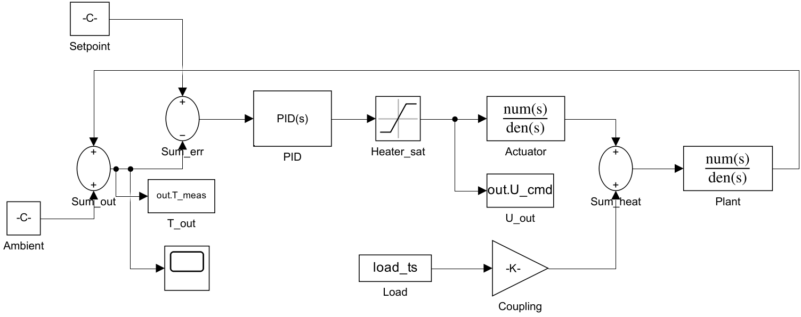
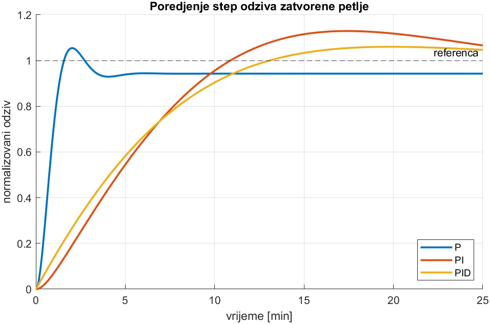
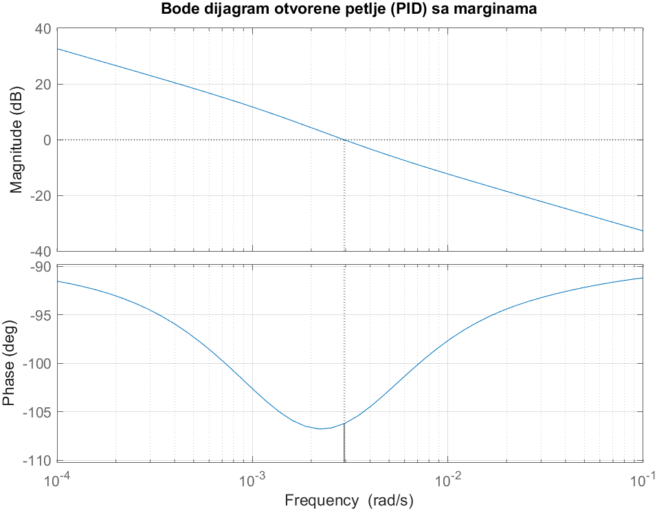
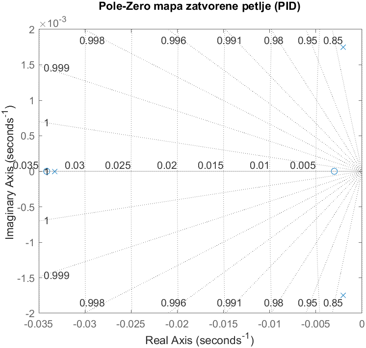
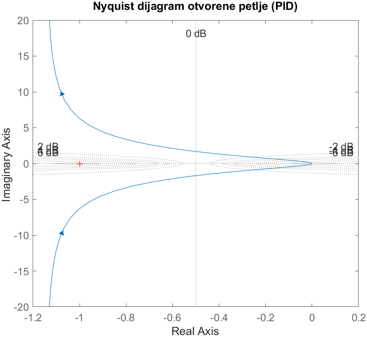
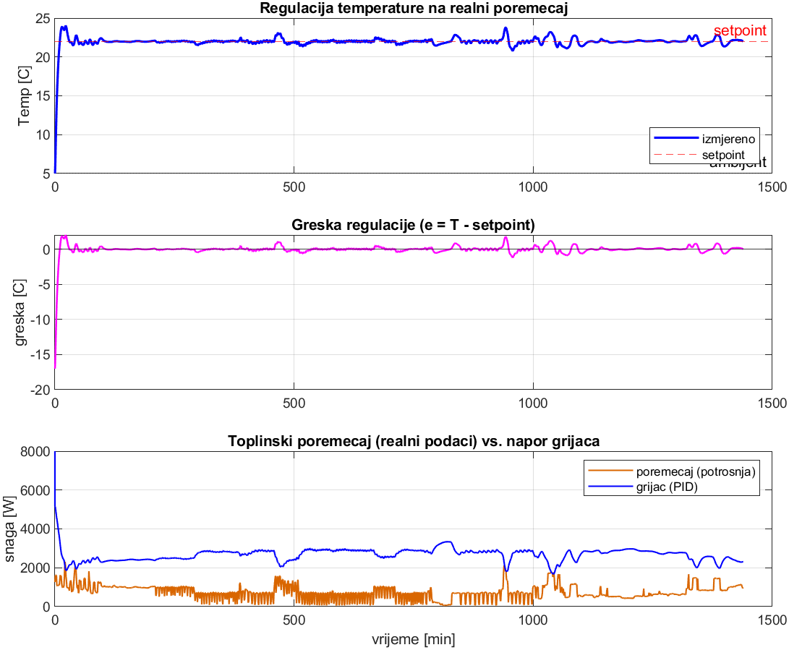
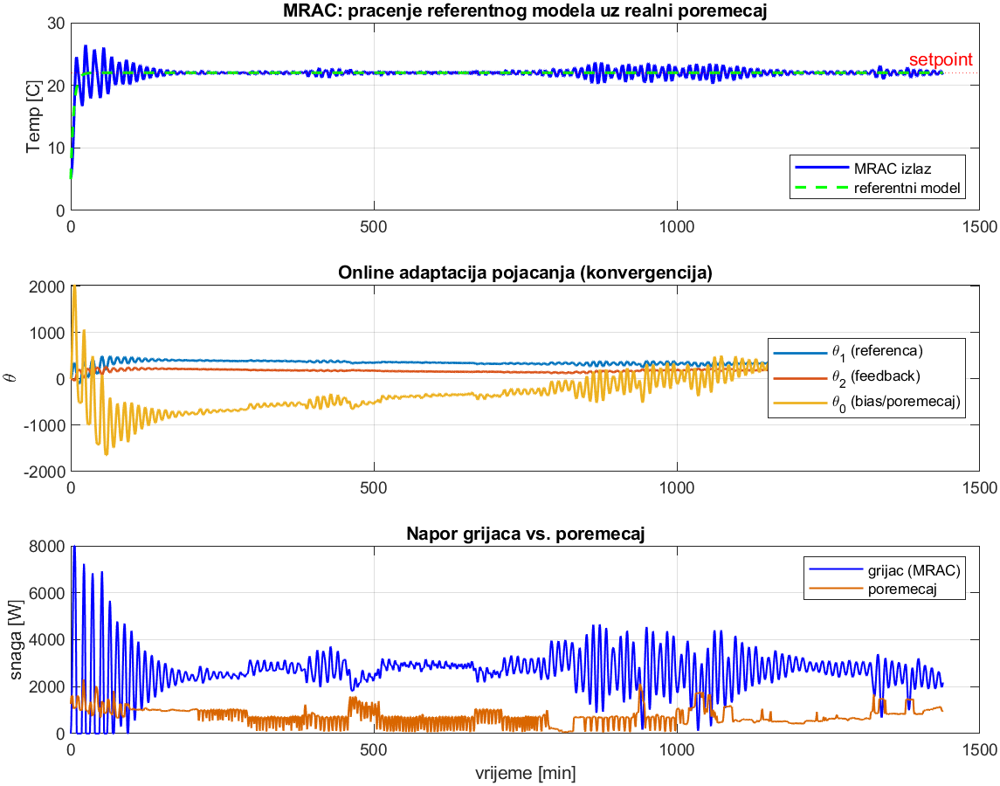
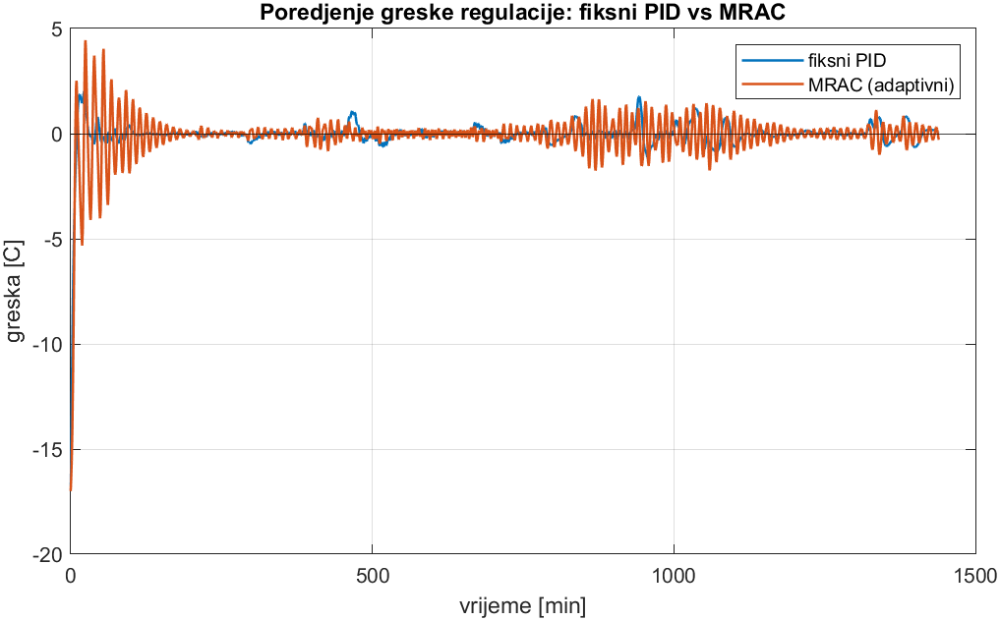
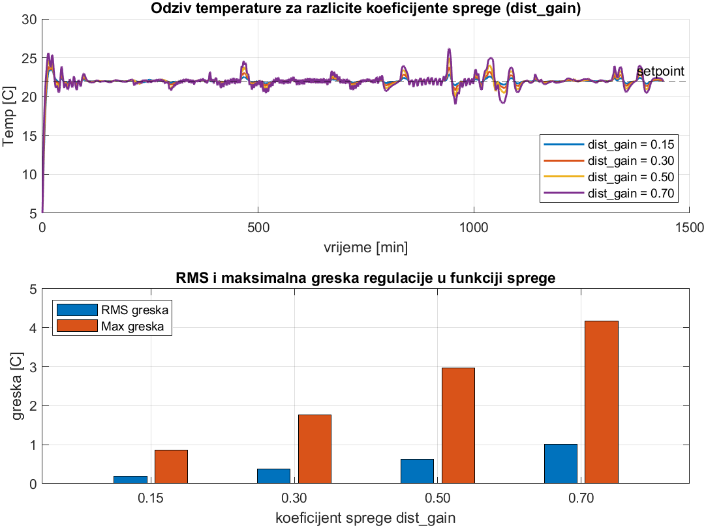

# Adaptive Temperature Control System Simulation (MATLAB / Simulink)

[🇧🇦 Bosanski](README.md) | **🇬🇧 English**

Project for the course **Computer Modeling and Simulation** (MSc SE).
Topic 21 — feedback temperature regulation with a PID controller, driven by
**real-world data** on electric power consumption used as a thermal disturbance,
plus a bonus **MRAC** (adaptive) controller.

---

## Process flow and how it works

### Goal

The room temperature is regulated and held at a target value (**22 °C**), even
though the room starts cold (**5 °C**, winter conditions) and is continuously
disturbed by an external influence. The principle is the same as a thermostat
and repeats in a loop, every minute:

1. The current room temperature is measured.
2. It is compared with the target (22 °C) — how far off it is.
3. The required heating power is determined.
4. The room heats up, its state changes, and the procedure returns to step 1.

This continuous measuring of one's own result and correcting is called
**feedback** and is the basis of automatic control.

### Input data and disturbance

A table of real measurements of one household's electric power consumption is
used (minute resolution, several years). The table **does not contain
temperature** — only the power-consumption value.

The starting point is the fact that all consumed electric energy eventually
turns into heat (appliances, lighting, machines warm the space). Therefore the
power consumption is used as a **disturbance** — a real and unpredictable
influence that additionally heats the room and which the controller must
compensate to keep 22 °C. This way the simulation is driven by real data, not
assumed data.

### Relationship between input and temperature

- The power consumption from the table is not the temperature, but the
  **input (disturbance)**.
- The temperature is **computed** from the laws of physics (based on the heat
  entering from the heater and the disturbance, and the heat lost through the
  walls).
- The flow is therefore: table provides the disturbance → controller sets the
  heating → temperature is computed as the room's response → controller reads
  it and corrects itself. The procedure repeats over the whole simulated
  period.

### Assumptions for realism

Since not all consumed energy turns into useful heat for that room, two careful
assumptions are introduced:

- Only **active power** (`Global_active_power`) is used, because only it is
  actually consumed and converted into heat. **Reactive power**
  (`Global_reactive_power`) is left out, because it is not converted into heat
  but oscillates between the source and the load.
- Only a fraction of that power (≈ **30 %**, parameter `dist_gain = 0.30`) is
  taken as heat that actually warms the observed room. The rest goes to lighting
  through windows, to other rooms and to ventilation. This avoids the
  unrealistic assumption that all consumption heats exactly that room.

### Result

The temperature was raised from 5 °C to 22 °C and held throughout the whole
simulated day, despite the constant disturbance. The average steady-state
deviation is ≈ **0.37 °C**. The system was shown to be **stable** and the full
PID outperforms the simpler variants (P, PI). As an extension, the **MRAC**
controller tunes its own gains during operation (adaptive control from the
assignment title).

---

## Model concept

The room temperature is regulated to a target value (**22 °C**) under winter
conditions (ambient **5 °C**). The thermal model of the room is a 2nd-order
system (actuator/heater + thermal inertia of the room):

```
C·dT/dt = Q_heater + Q_disturbance − (T − T_amb)/R
```

Transfer function from heat [W] to temperature [°C]:
`G(s) = R / (τ·s + 1)`, with `τ = R·C`. The actuator adds a lag `1/(τ₂·s+1)`.

**Real data as disturbance:** the `Global_active_power` [kW] column from the
UCI/Kaggle *Individual Household Electric Power Consumption* dataset is
interpreted as a thermal load (consumed power → heat in the room). The PID must
hold 22 °C despite this real, time-varying load.

## Block diagram (`temp_control.slx`)



Simplified signal-flow view:

```
Setpoint(22°C) → [Σ error] → [PID] → [Heater saturation] → [Actuator]
                     ↑                                          ↓
                     │                     real data → [×coupling] → [Σ +disturbance]
                     │                                          ↓
                     └──── feedback ──── [+ambient] ← [Plant: room]
```

## Project structure

| File | Description |
|------|-------------|
| `prepare_data.m` | Loads and cleans the dataset, builds the thermal disturbance (1 day, per minute) |
| `build_model.m` | **Programmatically builds** the Simulink block diagram |
| `run_project.m` | **Main script**: preparation → PID tuning → build → simulation |
| `analyze_stability.m` | Analysis: P/PI/PID comparison, Bode, pole-zero, Nyquist, metrics |
| `mrac_control.m` | Bonus: Model Reference Adaptive Control (adaptive controller) |
| `sensitivity_analysis.m` | Sensitivity analysis on the disturbance coupling factor |
| `temp_control.slx` | Generated Simulink model |
| `data/household_power_consumption.txt` | Real dataset |
| `figures/` | All plots (PNG) |
| `performanse.csv`, `osjetljivost.csv`, `results.mat` | Numerical results |

## Dataset (download)

The dataset is read **locally** and is not included in the repository (≈ 133 MB,
exceeds GitHub's 100 MB limit). It is downloaded separately and placed in the
`data/` folder:

1. Download *Individual Household Electric Power Consumption* from
   [Kaggle](https://www.kaggle.com/datasets/uciml/electric-power-consumption-data-set)
   or [UCI](https://archive.ics.uci.edu/dataset/235/individual+household+electric+power+consumption).
2. Unzip and place the file like this:
   `data/household_power_consumption.txt`

The scripts then read the data from disk; nothing is downloaded at runtime.

## How to run

In MATLAB (R2023b+, requires Simulink + Control System Toolbox):

```matlab
run_project            % 1) builds the model and runs the simulation with PID
analyze_stability      % 2) stability analysis + all plots
mrac_control           % 3) bonus: adaptive MRAC + comparison with PID
sensitivity_analysis   % 4) sensitivity analysis on the coupling factor
```

## Key results

**Controller comparison (`performanse.csv`):**

| Controller | Rise [s] | Settling [s] | Overshoot | Steady-state error | Phase margin |
|------------|----------|--------------|-----------|--------------------|--------------|
| P   | 57  | 188  | 11.9 % | 6 % (present) | 60.0° |
| PI  | 468 | 1792 | 12.9 % | 0 % | 60.0° |
| **PID** | 551 | 1908 | **6.0 %** | **0 %** | **73.8°** |

**Stability (PID, real disturbance):** system stable (all poles Re<0),
steady-state RMS error **0.37 °C**, maximum error **1.77 °C**.

**MRAC (adaptive):** gains converge online (θ₁≈290, θ₂≈178, θ₀≈239),
RMS error **0.52 °C**, max **1.76 °C** — even though it treats a 2nd-order plant
as 1st order (robustness to unmodeled dynamics).

**Sensitivity to the coupling factor (`osjetljivost.csv`):**

| dist_gain | RMS error | Max error | Max temp |
|-----------|-----------|-----------|----------|
| 0.15 | 0.19 °C | 0.87 °C | 23.5 °C |
| **0.30** (used) | **0.37 °C** | **1.77 °C** | **24.0 °C** |
| 0.50 | 0.62 °C | 2.98 °C | 25.0 °C |
| 0.70 | 1.01 °C | 4.18 °C | 26.2 °C |

The system stays **stable and with no steady-state error** for all tested
values; only the transient deviation grows with stronger disturbances. The
choice of 0.30 gives a realistic and gentle operating regime.

## System transfer function (algebraic and exponential form)

### Algebraic form (rational function of `s`)

Building blocks:

```
Actuator:    G_act(s) = 1 / (30 s + 1)
Room:        G_p(s)   = 0.005 / (600 s + 1)
Process:     P(s) = G_act·G_p = 0.005 / (18000 s² + 630 s + 1)
PID:         C(s) = (8334 s² + 309.6 s + 0.856) / s
                  = 8334.1 (s + 0.03414)(s + 0.003008) / s
```

Open loop `L(s) = C(s)·P(s)`:

```
            0.002315 s² + 8.600·10⁻⁵ s + 2.378·10⁻⁷
L(s) = ─────────────────────────────────────────────
              s³ + 0.035 s² + 5.556·10⁻⁵ s
```

Closed loop (end-to-end) `T(s) = L / (1 + L)`:

```
            0.002315 s² + 8.600·10⁻⁵ s + 2.378·10⁻⁷
T(s) = ───────────────────────────────────────────────────
        s³ + 0.03732 s² + 1.416·10⁻⁴ s + 2.378·10⁻⁷
```

Closed-loop poles (all Re < 0 → stable):
`s₁ = −0.0333`, `s₂,₃ = −0.0020 ± 0.0018·j`.

### Exponential form `G(jω) = |G(jω)|·e^{jφ(ω)}`

For a first-order block `K/(τs+1)`, substituting `s = jω`:

```
G(jω) = K/(1+jωτ) = [ K / √(1+(ωτ)²) ] · e^( −j·arctan(ωτ) )
```

Individual blocks:

```
G_act(jω):  |G| = 1 / √(1+(30ω)²),       φ = −arctan(30ω)
G_p(jω):    |G| = 0.005 / √(1+(600ω)²),  φ = −arctan(600ω)
```

Process (magnitudes multiply, phases add):

```
|P(jω)| = 0.005 / [ √(1+(30ω)²) · √(1+(600ω)²) ]
 φ_P(ω) = −arctan(30ω) − arctan(600ω)
```

PID `C(jω) = Kp + j(ωKd − Ki/ω)`:

```
|C(jω)| = √( Kp² + (ωKd − Ki/ω)² )
 φ_C(ω) = arctan( (ωKd − Ki/ω) / Kp )
```

Open and closed loop:

```
L(jω) = |C(jω)|·|P(jω)| · e^{ j(φ_C + φ_P) }
T(jω) = ( |L| / |1+L| ) · e^{ j( argL − arg(1+L) ) }
```

In the exponential form **magnitudes multiply and phases add** — which is
exactly why the Bode diagram works: multiplication of magnitudes becomes
addition in decibels, and phases add directly.

## Stability analysis: which loop and why

Each stability tool is tied to a specific loop — this is not arbitrary but
follows from the very definition of the method. Two transfer functions are
considered:

- **Open loop** `L(s) = C(s)·P(s)` — controller and process in series, without
  closing the feedback.
- **Closed loop** `T(s) = L(s) / (1 + L(s))` — the actual operating system,
  with feedback.

| Tool | Loop | Why this loop |
|------|------|---------------|
| **Bode + margins** | **open** `L(s)` | Gain and phase margins are **defined on the open loop** — read from the magnitude and phase of `L(s)`. They measure how much reserve the system has before instability; this information exists only on the open loop. |
| **Nyquist** | **open** `L(s)` | The Nyquist criterion is **by nature a method over the open loop**: `L(jω)` is plotted and encirclements of the point (−1, 0) are counted — `Z = N + P`. The goal is to **conclude** about the closed loop from the open loop, so Nyquist on the closed loop makes no sense. |
| **Pole-zero** | **closed** `T(s)` | The actual operating system is the closed loop. Its stability depends on the roots of `1 + L(s) = 0`, i.e. on the **closed-loop poles**. If all are Re < 0 → stable. Open-loop poles do not prove this (a stable open loop can yield an unstable closed loop and vice versa). |

The logic is therefore twofold: the **open loop predicts** stability and gives
the margins (Bode, Nyquist), while the **closed loop directly confirms**
stability (pole locations). All three tools give the same conclusion — a stable
system — which is a cross-check from three angles.

## Plots with explanations

### System block diagram


Structure of the model in Simulink: the reference (Setpoint) and the measured
temperature enter the error summer, the PID determines the heater power (limited
by saturation), the actuator and the room (Plant) produce the temperature, and
the real data (Load) enters as a disturbance through the coupling factor. The
feedback closes the loop.

### 1. Step response comparison P / PI / PID


Closed-loop response to a reference step. **P** is fast but a steady-state error
remains (it does not reach 1). **PI** removes the error but is slower and with a
larger overshoot. **PID** has the smallest overshoot and zero steady-state error
— the best compromise.

### 2. Bode diagram + stability margins (PID)


Open-loop frequency response. Shows the **phase and gain margin** — a measure of
how far the system is from instability. A high phase margin (≈ 74°) means a
robust, well-damped system.

### 3. Pole-zero map of the closed loop (PID)


Position of the system poles in the complex plane. **All poles are to the left
of the imaginary axis (Re < 0)** → the system is stable. The pole locations
determine the speed and damping of the response.

### 4. Nyquist diagram (PID)


Another proof of stability: the curve does not encircle the critical point
(−1, 0), which by the Nyquist criterion confirms closed-loop stability.

### 5. Regulation under the real disturbance (PID)


The main result. Top: the temperature rises from 5 °C and is held at 22 °C all
day. Middle: the error stays near zero. Bottom: the **inverse coupling** is
visible — when the disturbance (consumption) spikes, the PID reduces the heater
power, and vice versa.

### 6. MRAC — tracking and gain adaptation


The adaptive controller. Top: the output tracks the reference model. Middle:
**the gains adjust (learn) by themselves during operation** and converge.
Bottom: heater effort vs. the disturbance.

### 7. Error comparison PID vs MRAC


A direct comparison of the regulation error of the fixed PID and the adaptive
MRAC under the same real disturbance.

### 8. Sensitivity analysis


Response for different values of the coupling factor. Top: temperature
responses. Bottom: RMS and maximum error grow with the factor, but the system
stays stable — confirming that the conclusions do not depend critically on that
estimate.

## Conclusion

The feedback PID solves the task: zero steady-state error (the I term), low
overshoot and a high phase margin (robustness) — while the real power-consumption
data constantly disturbs it. MRAC additionally demonstrates the principle of
adaptive control: the controller learns its gains during operation, without
prior tuning, and remains stable under unmodeled dynamics and real disturbances.
The sensitivity analysis shows that the conclusions on stability and accuracy
hold over a wide range of the coupling factor, so the results do not depend
critically on that estimate.
